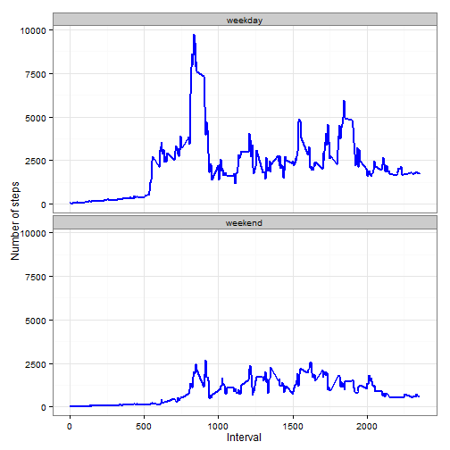

# Reproducible Research: Peer Assessment 1

## Loading and preprocessing the data

```r
library(ggplot2)

read_data <- function(fname) {
    source_url = "https://d396qusza40orc.cloudfront.net/repdata%2Fdata%2Factivity.zip"
    if (!file.exists(fname)) {
        download.file(source_url, destfile = fname, method = "curl")
    }
    tmp <- unzip("activity.zip")
    tmp <- read.csv(tmp, header = T, colClasses = c("numeric", "character", 
        "numeric"))
    tmp$interval <- factor(tmp$interval)
    tmp$date <- as.Date(tmp$date, format = "%Y-%m-%d")
    tmp
}
activity <- read_data("activity.zip")
```


## What is mean total number of steps taken per day?
1. Make a histogram of the total number of steps taken each day


```r

steps_per_day <- aggregate(steps ~ date, data = activity, FUN = sum)
hist(steps_per_day$steps, xlab = "total amounts", ylab = "frequencies")
```

 

```r

```

2. Calculate and report the **mean** and **median** total number of steps taken per day


```r

steps_per_interval <- aggregate(steps ~ interval, data = activity, FUN = mean)
steps_per_interval$interval <- as.integer(levels(steps_per_interval$interval))
mean_steps <- mean(steps_per_day$steps)
median_steps <- median(steps_per_day$steps)
```

## What is the average daily activity pattern?
1. Make a time series plot (i.e. `type = "l"`) of the 5-minute
   interval (x-axis) and the average number of steps taken, averaged
   across all days (y-axis)


```r
plot(steps_per_interval, type = "l")
```

 

 2. Which 5-minute interval, on average across all the days in the dataset, 
 contains the maximum number of steps?


```r
max_step_interval <- steps_per_interval$interval[which.max(steps_per_interval$steps)]
max_step_interval
```

```
## [1] 835
```

## Imputing missing values
1. Calculate and report the total number of missing values in the
dataset (i.e. the total number of rows with `NA`s)

```r
sum(is.na(activity))
```

```
## [1] 2304
```

2. Devise a strategy for filling in all of the missing values in the
   dataset. The strategy does not need to be sophisticated. For example, 
   you could use the mean/median for that day, or the mean
   for that 5-minute interval, etc.
I will use the means for the 5-minute intervals as fillers for missing
values.

3. Create a new dataset that is equal to the original dataset but with
   the missing data filled in.


```r

filled_means <- function(activity) {
    na_indices <- which(is.na(activity$steps))
    
    na_replacements <- unlist(lapply(na_indices, FUN = function(idx) {
        interval = activity[idx, ]$interval
    }))
    tmp <- activity$steps
    tmp[na_indices] <- na_replacements
    tmp
}

new_data <- data.frame(steps = filled_means(activity), date = activity$date, 
    interval = activity$interval)
```

4. Make a histogram of the total number of steps taken each day and
   Calculate and report the **mean** and **median** total number of
   steps taken per day. Do these values differ from the estimates from
   the first part of the assignment? What is the impact of imputing
   missing data on the estimates of the total daily number of steps?


```r

filled_steps_per_day <- aggregate(steps ~ date, data = new_data, FUN = sum)
filled_median_steps = median(filled_steps_per_day$steps)
filled_mean_steps = mean(filled_steps_per_day$steps)

hist(steps_per_day$steps, xlab = "date", ylab = "steps")
```

 


## Are there differences in activity patterns between weekdays and weekends?
1. Create a new factor variable in the dataset with two levels, "weekday" and "weekend"  presenting whether a given date is a weekday or weekend day.

```r
daytype <- function(date) {
    if (weekdays(as.Date(date)) == "Saturday" | weekdays(as.Date(date)) == "Sunday") {
        "weekend"
    } else {
        "weekday"
    }
}


fill_category_of_data <- function(filling_data) {
    filling_data$daytype <- as.factor(sapply(filling_data$date, daytype))
    weekend <- subset(filling_data, filling_data$daytype == "weekend")
    weekend_steps_per_interval <- aggregate(steps ~ interval, data = weekend, 
        FUN = sum)
    weekend_steps_per_interval$daytype <- rep("weekend", nrow(weekend_steps_per_interval))
    
    weekday <- subset(filling_data, filling_data$daytype == "weekday")
    weekday_steps_per_interval <- aggregate(steps ~ interval, data = weekday, 
        FUN = sum)
    weekday_steps_per_interval$daytype <- rep("weekday", nrow(weekday_steps_per_interval))
    tmp <- rbind(weekend_steps_per_interval, weekday_steps_per_interval)
    tmp$daytype <- as.factor(tmp$daytype)
    tmp$interval <- as.numeric(levels(tmp$interval))[tmp$interval]
    tmp
}
```


2. Make a panel plot containing a time series plot (i.e. `type = "l"`)
   of the 5-minute interval (x-axis) and the average number of steps
   taken, averaged across all weekday days or weekend days
   (y-axis).

```r
plot_comparison <- function(new_data) {
    ggplot(new_data, aes(x = interval, y = steps)) + geom_line(color = "blue", 
        size = 1) + facet_wrap(~daytype, nrow = 2, ncol = 1) + labs(x = "Interval", 
        y = "Number of steps") + theme_bw()
}

complete_data <- fill_category_of_data(new_data)

plot_comparison(complete_data)
```

 
