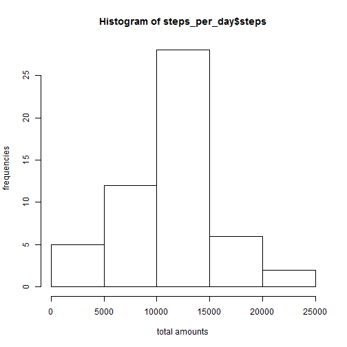
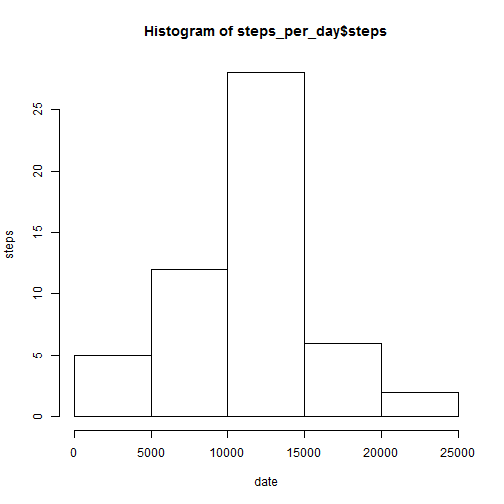

# Reproducible Research: Peer Assessment 1


## Loading and preprocessing the data
## Loading and preprocessing the data

```r
unzip("activity.zip")
activity <- read.csv("activity.csv")
```


## What is mean total number of steps taken per day?
1. Make a histogram of the total number of steps taken each day

```r
steps.date <- aggregate(steps ~ date, data = activity, FUN = sum)
hist(steps.date$steps, xlab = "total amounts", ylab = "frequencies")
```

 

2. Calculate and report the **mean** and **median** total number of
   steps taken per day


```r
mean(steps.date$steps)
```

```
## [1] 10766
```

```r
median(steps.date$steps)
```

```
## [1] 10765
```

## What is the average daily activity pattern?
1. Make a time series plot (i.e. `type = "l"`) of the 5-minute
   interval (x-axis) and the average number of steps taken, averaged
   across all days (y-axis)


```r
steps.interval <- aggregate(steps ~ interval, data = activity, FUN = mean)
plot(steps.interval, type = "l")
```

 


2. Which 5-minute interval, on average across all the days in the
   dataset, contains the maximum number of steps?


```r
steps.interval$interval[which.max(steps.interval$steps)]
```

```
## [1] 835
```


## Imputing missing values
1. Calculate and report the total number of missing values in the
   dataset (i.e. the total number of rows with `NA`s)


```r
sum(is.na(activity))
```

```
## [1] 2304
```

2.  Devise a strategy for filling in all of the missing values in the dataset. The strategy does not need to be sophisticated. For example, you could use the mean/median for that day, or the mean for that 5-minute interval, etc.

 As missing values are steps, we can use the mean for the 5-minute intervals c for missing values.

3. Create a new dataset that is equal to the original dataset but with the missing data filled in

```r
activity <- merge(activity, steps.interval, by = "interval", suffixes = c(""))
nas <- is.na(activity$steps)
activity$steps[nas] <- activity$steps.y[nas]
```

```
## Error: replacement has length zero
```

```r
activity <- activity[, c(1:3)]
```


4.	Make a histogram of the total number of steps taken each day and Calculate and report the mean and median total number of steps taken per day. Do these values differ from the estimates from the first part of the assignment? What is the impact of imputing missing data on the estimates of the total daily number of steps?


```r
steps.date <- aggregate(steps ~ date, data = activity, FUN = sum)
hist(steps.date$steps, names.arg = steps.date$date, xlab = "date", ylab = "steps")
```

```
## Warning: "names.arg" is not a graphical parameter
## Warning: "names.arg" is not a graphical parameter
## Warning: "names.arg" is not a graphical parameter
```

 

```r
mean(steps.date$steps)
```

```
## [1] 10766
```

```r
median(steps.date$steps)
```

```
## [1] 10765
```


## Are there differences in activity patterns between weekdays and weekends?
